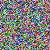
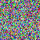
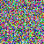

# Working with Images

CMX makes it easy to save and display images in your documentation.

```python
doc @ "## Random Image"

# Create a random RGB image
random_image = np.random.rand(100, 100, 3)
random_image = (random_image * 255).astype(np.uint8)

# Save and display
doc.image(random_image, src="random.png")
```
## Random Image


```python
doc @ "## Gradient Image"

# Create a gradient
x = np.linspace(0, 1, 200)
y = np.linspace(0, 1, 200)
xx, yy = np.meshgrid(x, y)
gradient = np.stack([xx, yy, np.zeros_like(xx)], axis=-1)
gradient = (gradient * 255).astype(np.uint8)

doc.image(gradient, src="gradient.png")
```
## Gradient Image


```python
doc @ "## Multiple Images in a Row"

with doc.row():
    # Create and display multiple images side by side
    for i in range(3):
        img = np.random.rand(50, 50, 3)
        img = (img * 255).astype(np.uint8)
        doc.image(img, src=f"mini_{i}.png")
```
## Multiple Images in a Row

<div style="flex-wrap:nowrap; display:flex; flex-direction:row; item-align:center;"></div>






