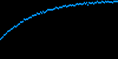

# Machine Learning Experiment Report

**Date**: 2024-01-15
**Experiment**: Image Classification Baseline

## Overview

This report documents the baseline experiment for image classification
using different neural network architectures.

## Experiment Configuration

```python
config = {
    "dataset": "ImageNet-1k",
    "batch_size": 64,
    "learning_rate": 0.001,
    "optimizer": "Adam",
    "epochs": 100,
    "augmentation": True,
}

doc.yaml(config)
```

```yaml
augmentation: true
batch_size: 64
dataset: ImageNet-1k
epochs: 100
learning_rate: 0.001
optimizer: Adam
```

## Results

### Model Comparison

```python
results = pd.DataFrame(
    {
        "Model": models,
        "Accuracy": [f"{a:.1%}" for a in accuracies],
        "Training Time (min)": training_times,
        "Parameters": params,
    }
)

doc.table(results, show_index=False)
```

| Model           | Accuracy   |   Training Time (min) | Parameters   |
|-----------------|------------|-----------------------|--------------|
| ResNet50        | 94.5%      |                   145 | 25.6M        |
| VGG16           | 87.2%      |                   203 | 138M         |
| MobileNetV2     | 91.8%      |                    98 | 3.5M         |
| EfficientNet-B0 | 95.6%      |                   167 | 5.3M         |

### Performance Analysis

```python
best_model = models[np.argmax(accuracies)]
best_acc = max(accuracies)
fastest_model = models[np.argmin(training_times)]

doc.print(f"Best performing model: {best_model} ({best_acc:.1%})")
doc.print(f"Fastest training: {fastest_model} ({min(training_times)} min)")
```

```
Best performing model: EfficientNet-B0 (95.6%)
Fastest training: MobileNetV2 (98 min)
```

### Visualization

Training curves for the best model:

```python
# Generate sample training curve
epochs = np.arange(1, 101)
train_acc = 1 - np.exp(-epochs / 30) * 0.7 + np.random.randn(100) * 0.01
train_acc = np.clip(train_acc, 0, 1)

# Create a simple visualization (would use matplotlib in real scenario)
vis_data = np.zeros((100, 200, 3), dtype=np.uint8)
for i, acc in enumerate(train_acc):
    y = int((1 - acc) * 99)
    x = int(i * 2)
    if x < 200:
        vis_data[max(0, y - 1) : min(100, y + 2), x : x + 2] = [0, 150, 255]

doc.image(vis_data, src="training_curve.png")
```



## Conclusions

1. EfficientNet-B0 achieved the best accuracy with reasonable parameters
2. MobileNetV2 offers the best speed/accuracy tradeoff
3. VGG16 is outdated for this task (high params, low accuracy)

## Next Steps

- [ ] Fine-tune EfficientNet-B0 with larger batch size
- [ ] Test MobileNetV2 for deployment
- [ ] Implement knowledge distillation
